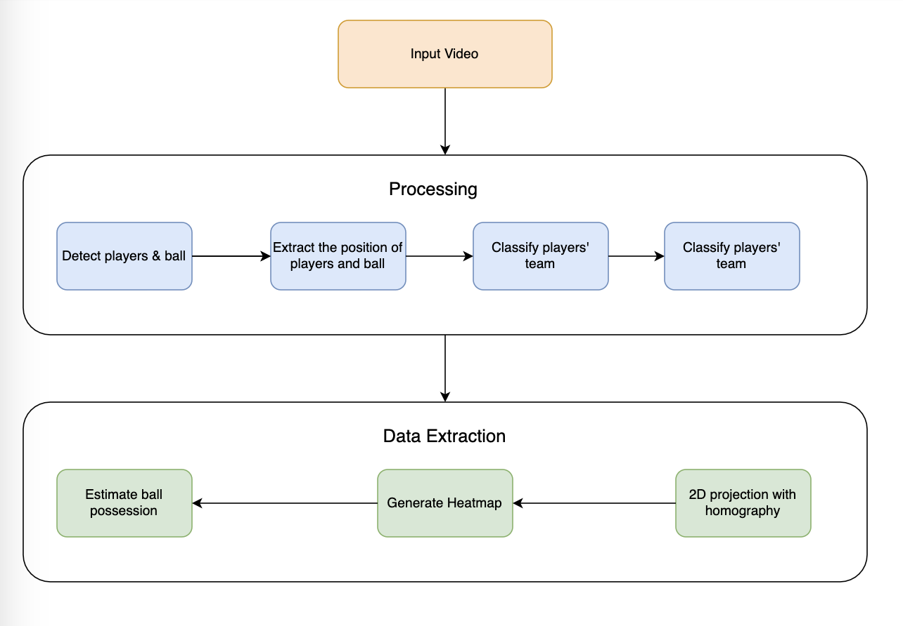
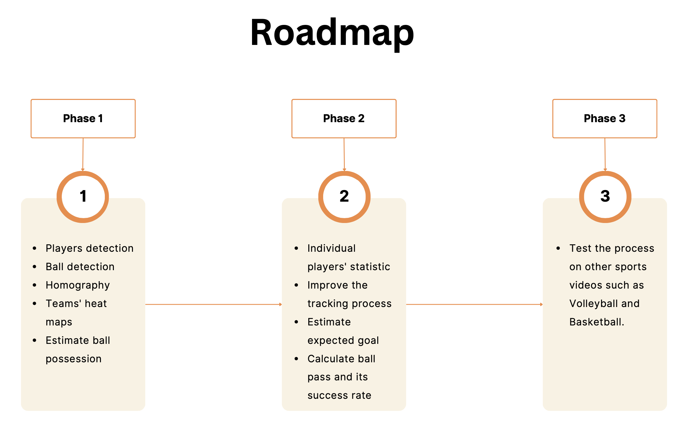

# EkycPASS ( Performance Analysis In Sport )

# 1. Project Description

EkycPASS allows you to run detection and extract analysis from the sport videos.

EkycPASS can :

- Detect players and ball in the video
- Transform the input video into from 3D view to 2D template
- Generate heatmap on teams level
- Estimate the ball possession during the game

# 2. Sample Video

# 3. Process Flow

# 4. Roadmap

# 5. License

© 2023 EKYC Solutions Co, Ltd. All rights reserved.
